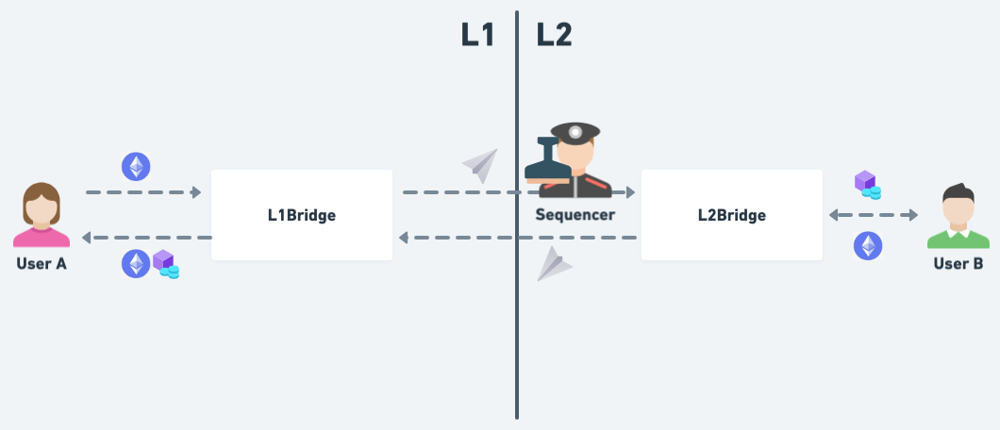
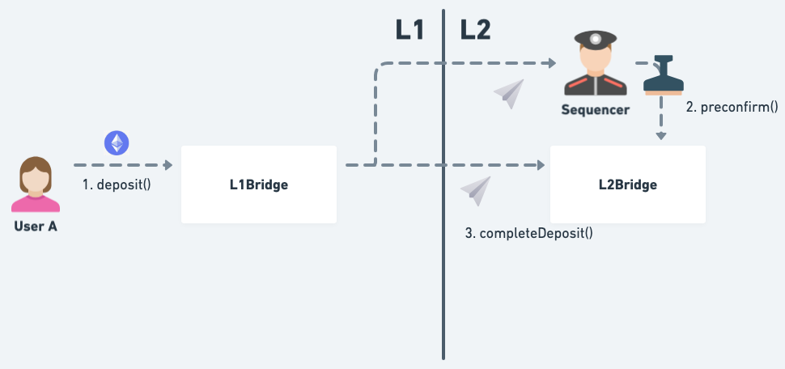
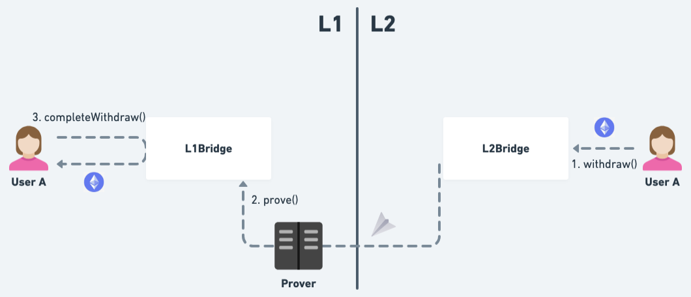
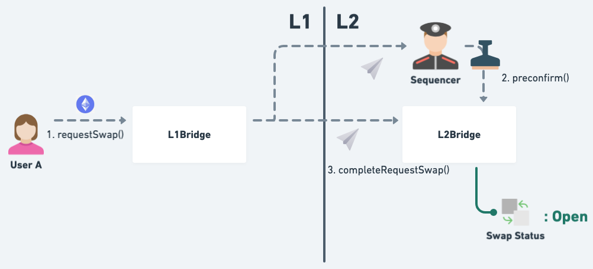
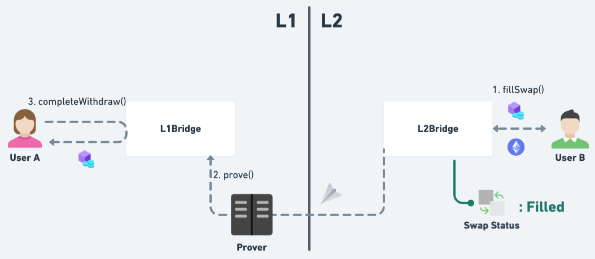
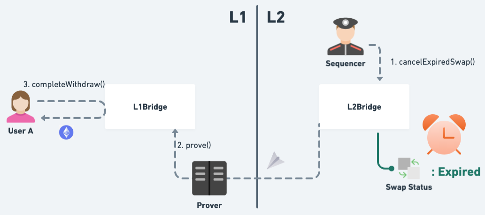

# Cross-Layer Atomic Swap POC

## Architecture

The system supports three main functionalities: **Deposit ETH from L1**, **Withdraw ETH from L2** and **Swap ETH for ERC20 tokens between L1 and L2**. They all comprise of token being locked on one side and a message sent to and processed on the other side.

Tokens are locked on `L1Bridge` and `L2Bridge` contracts respectively. Messages are sent and processed between the two contracts. Both contracts keep track of the nonce for each user to prevent message from being replayed.

A sequencer is used to process messages sent from L1 to L2. It listens for messages on `L1Bridge` and preconfirms them. Once a message is preconfirmed, it can be processed by `L2Bridge` contract.

### Deposit ETH from L1

User deposits ETH from L1 to L2 by calling `deposit` on the `L1Bridge` contract along with the amount of ETH to deposit. The `L1Bridge` contract locks the ETH and emits a `Deposit` event which is the message sent to the `L2Bridge` contract on L2.

The message then needs to be preconfirmed by the sequencer before it can be processed. The sequencer will sign over the hash of the message in EIP-712 format and send it to the `L2Bridge` contract via the `preconfirm` function. Once the message is preconfirmed, the message can be processed by sending a system transaction to execute `completeDeposit` on the `L2Bridge` contract.

### Withdraw ETH from L2

User withdraws ETH from L2 to L1 by calling `withdraw` on the `L2Bridge` contract along with the amount of ETH to withdraw. The `L2Bridge` contract will emit a `Withdraw` event which is the message sent to the `L1Bridge` contract on L1.

The message then needs to be proved first before user can claim the withdrawal. The prover will prove the message and send the hash of the message to the `L1Bridge` contract on L1 via the `prove` function. The verification of the proof is omitted in the contract. Once the message is proved, user can claim the withdrawal by calling `completeWithdraw` on the `L1Bridge` contract.

### Swap ETH for ERC20 tokens between L1 and L2

User swaps ETH for ERC20 tokens between L1 and L2 by first calling `requestSwap` on the `L1Bridge` contract along with the amount of ETH to swap, the address and the amount of the ERC-20 token to receive and the expiry time of the swap. The user can specify the counterparty for the swap in the `userB` field. The `L1Bridge` contract locks the ETH and emits a `RequestSwap` event which is the message sent to the `L2Bridge` contract on L2.

The message then needs to be preconfirmed by the sequencer too. Once the message is preconfirmed, the message can be processed by sending a system transaction to execute `completeRequestSwap` on the `L2Bridge` contract. After the swap request is processed, the specified userB can fill the swap by calling `fillSwap` on the `L2Bridge` contract. The contract will transfer the ERC-20 tokens from userB, mark the swap as filled and emit a `SwapFilled` event and a `Withdraw` event. The `Withdraw` event is the withdrawal message of the ERC-20 tokens userA receives. It follows the same flow as in the `Withdraw ETH from L2` section. The withdrawal is first proved and then userA can claim the withdrawal by calling `completeWithdraw` on the `L1Bridge` contract.

If the swap request is not filled before the expiry time, the sequencer will call `cancelExpiredSwap` on the `L2Bridge` contract to cancel the expired swap request. The `L2Bridge` contract will mark the swap as cancelled and emit a `SwapCancelled` event and a `Withdraw` event. The `Withdraw` event is the withdrawal message of the ETH userA deposited. It follows the same flow as in the `Withdraw ETH from L2` section. The withdrawal is first proved and then userA can claim the withdrawal by calling `completeWithdraw` on the `L1Bridge` contract.

### Assumptions in the system

#### L2 Node and Prover

There's a L2 node generating the system transactions to process the messages sent to L2 and a prover generating the proofs for the messages sent to L1. Generation of the system transactions and messages sent to L1 are part of the state transition function.

#### Sender of the system transaction will be the `L1Bridge` contract

The sender of the system transaction will be the `L1Bridge` contract and `L2Bridge` contract will verify that `msg.sender` is the `L1Bridge` contract. Sequencer can not stop or fake a system transaction to `L2Bridge` contract, that is, it can not stop an existed deposit or swap request, nor can it fake a non-existed deposit or swap request.

#### Assume token exists on both L1 and L2, and is deployed to the same address

As token that userA will receive in a successful swap will be withdrawn to L1. The tokens on L1 and L2 are deployed to the same address so the system do not need to keep a mapping between the token addresses on L1 and L2.

#### Users are EOA

Users are EOA so the system does not need to alias the user's address.

#### Deposit does not involve any data passing to L2

The deposit does not involve passing any data to any receiver on L2 so no need to charge user with conditional gas fee up front on L1 and hence user's deposit will not fail due to not enough gas.
